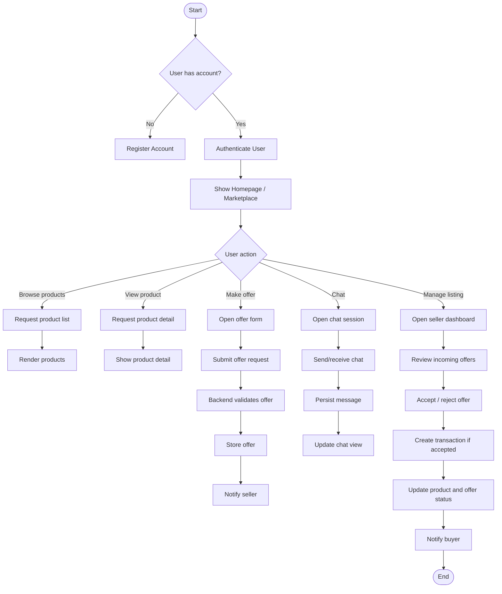
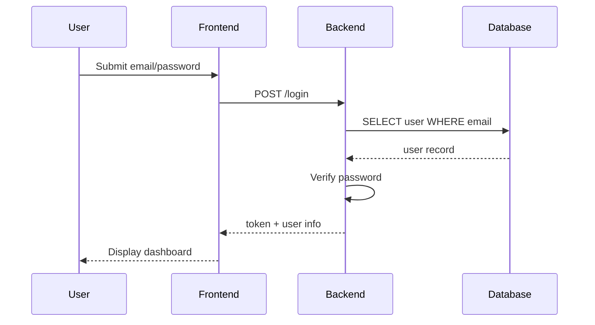
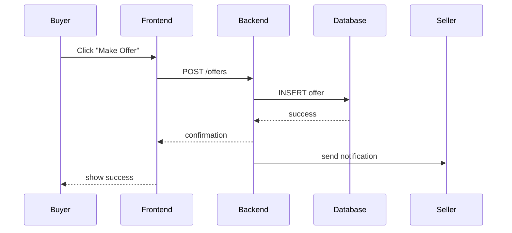
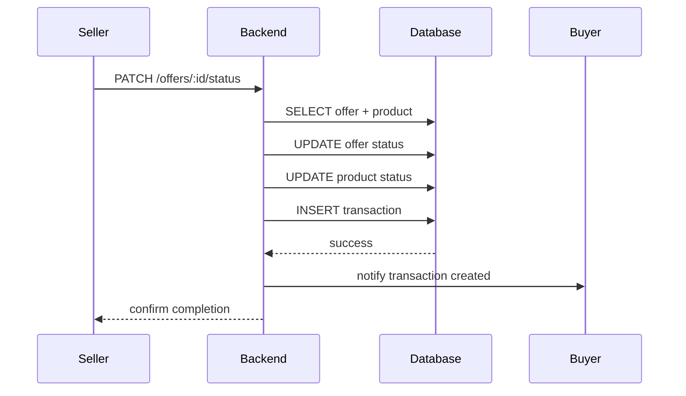
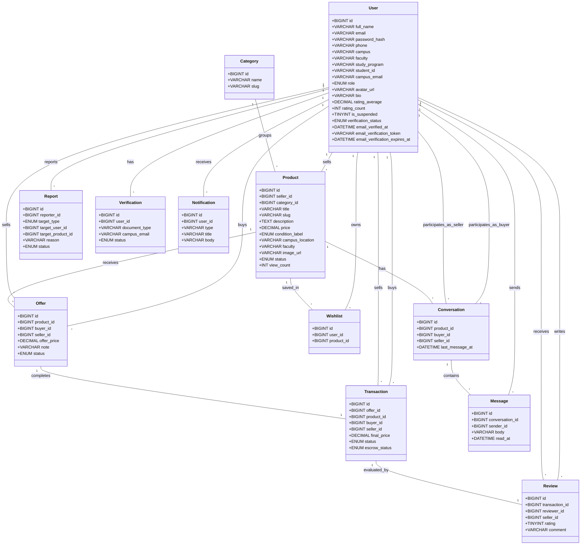

# C. UML Diagram

Dokumen ini menyajikan diagram UML untuk aplikasi BabePus: Use Case Diagram, Activity Diagram, Sequence Diagram, dan Class Diagram.

## 1. Use Case Diagram

```mermaid
usecaseDiagram
  actor User as U
  actor Seller as S
  actor Admin as A

  U --> (Register)
  U --> (Login)
  U --> (Browse Products)
  U --> (View Product Detail)
  U --> (Make Offer)
  U --> (Chat with Seller)
  U --> (Add Product to Wishlist)
  U --> (View Notifications)

  S --> (Login)
  S --> (Manage Listings)
  S --> (Review Offers)
  S --> (Accept / Reject Offer)
  S --> (Complete Transaction)
  S --> (Respond to Chat)

  A --> (Login)
  A --> (Review Reports)
  A --> (Verify Users)
  A --> (Manage Platform Data)

  (Make Offer) .> (Login) : requires
  (Manage Listings) .> (Login) : requires
  (Review Reports) .> (Login) : requires
```

## 2. Activity Diagram



## 3. Sequence Diagram

### 3.1 Login Sequence



### 3.2 Create Offer Sequence



### 3.3 Complete Transaction Sequence



## 4. Class Diagram



## 5. Keterangan

- Use Case Diagram menampilkan aktor utama: `User`, `Seller`, `Admin`.
- Activity Diagram menunjukkan alur autentikasi, pencarian produk, pembuatan penawaran, dan transaksi.
- Sequence Diagram mengilustrasikan interaksi frontend-backend-database untuk login, penawaran, dan penyelesaian transaksi.
- Class Diagram menampilkan entitas data utama dan relasi antar objek sesuai struktur database.
