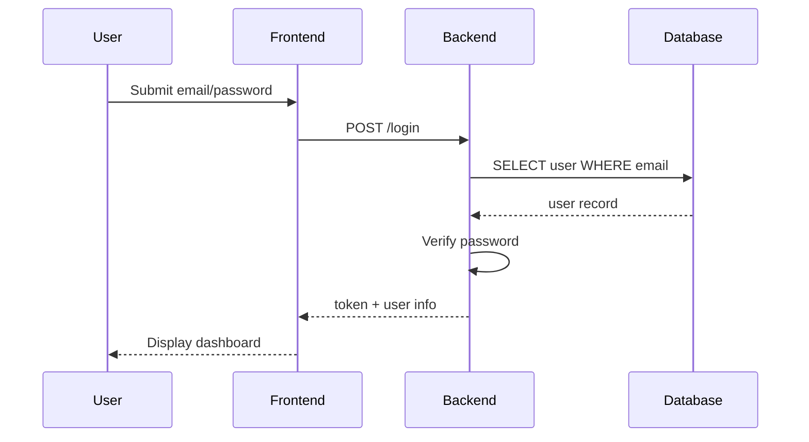
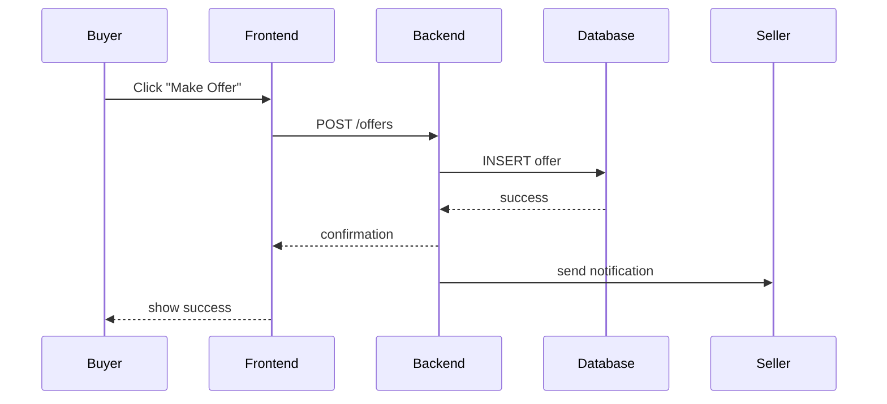
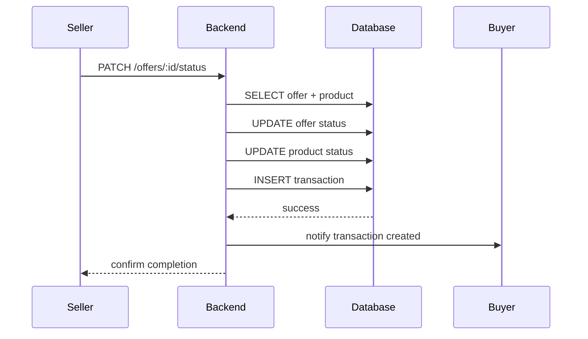
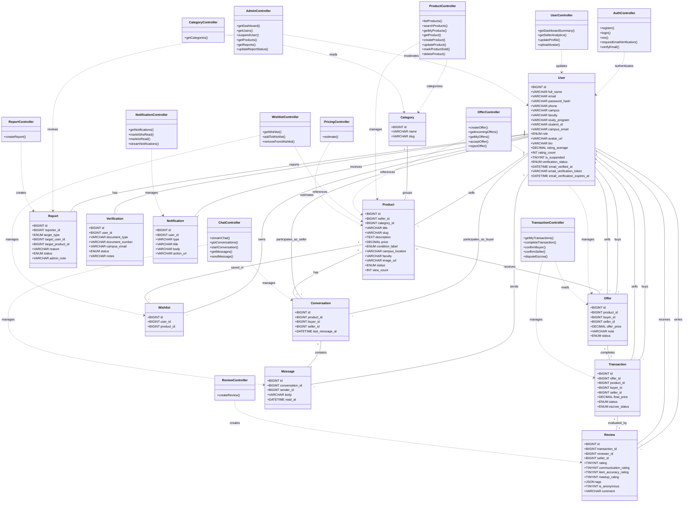

# C. UML Diagram

Dokumen ini menyajikan diagram UML untuk aplikasi BabePus: Use Case Diagram, Activity Diagram, Sequence Diagram, dan Class Diagram.

## 1. Use Case Diagram

```mermaid
erDiagram
    users {
        bigint id PK
        varchar full_name
        varchar email UK
        varchar password_hash
        varchar phone
        varchar campus
        varchar faculty
        varchar study_program
        varchar student_id
        varchar campus_email
        enum role
        varchar avatar_url
        varchar bio
        decimal rating_average
        int rating_count
        tinyint is_suspended
        enum verification_status
        datetime email_verified_at
        varchar email_verification_token
        datetime email_verification_expires_at
        timestamp created_at
        timestamp updated_at
    }

    categories {
        bigint id PK
        varchar name
        varchar slug UK
        timestamp created_at
        timestamp updated_at
    }

    products {
        bigint id PK
        bigint seller_id FK
        bigint category_id FK
        varchar title
        varchar slug UK
        text description
        decimal price
        enum condition_label
        varchar campus_location
        varchar faculty
        varchar image_url
        enum status
        int view_count
        datetime sold_at
        datetime deleted_at
        timestamp created_at
        timestamp updated_at
    }

    offers {
        bigint id PK
        bigint product_id FK
        bigint buyer_id FK
        bigint seller_id FK
        decimal offer_price
        varchar note
        enum status
        timestamp created_at
        timestamp updated_at
    }

    transactions {
        bigint id PK
        bigint offer_id FK UK
        bigint product_id FK
        bigint buyer_id FK
        bigint seller_id FK
        decimal final_price
        enum status
        enum escrow_status
        datetime buyer_confirmed_at
        datetime seller_confirmed_at
        datetime payout_released_at
        datetime completed_at
        timestamp created_at
        timestamp updated_at
    }

    reviews {
        bigint id PK
        bigint transaction_id FK UK
        bigint reviewer_id FK
        bigint seller_id FK
        tinyint rating
        tinyint communication_rating
        tinyint item_accuracy_rating
        tinyint meetup_rating
        json tags
        tinyint is_anonymous
        varchar comment
        timestamp created_at
        timestamp updated_at
    }

    reports {
        bigint id PK
        bigint reporter_id FK
        enum target_type
        bigint target_user_id FK
        bigint target_product_id FK
        varchar reason
        varchar details
        enum status
        varchar admin_note
        bigint reviewed_by FK
        datetime reviewed_at
        timestamp created_at
        timestamp updated_at
    }

    verifications {
        bigint id PK
        bigint user_id FK
        varchar document_type
        varchar document_number
        varchar campus_email
        enum status
        varchar notes
        bigint verified_by FK
        datetime verified_at
        timestamp created_at
        timestamp updated_at
    }

    wishlists {
        bigint id PK
        bigint user_id FK
        bigint product_id FK
        timestamp created_at
    }

    notifications {
        bigint id PK
        bigint user_id FK
        varchar type
        varchar title
        varchar body
        varchar action_url
        datetime read_at
        timestamp created_at
    }

    conversations {
        bigint id PK
        bigint product_id FK
        bigint buyer_id FK
        bigint seller_id FK
        datetime last_message_at
        timestamp created_at
        timestamp updated_at
    }

    messages {
        bigint id PK
        bigint conversation_id FK
        bigint sender_id FK
        varchar body
        datetime read_at
        timestamp created_at
    }

    escrow_events {
        bigint id PK
        bigint transaction_id FK
        bigint actor_id FK
        varchar event_type
        varchar note
        timestamp created_at
    }

    users ||--o{ products : "sells"
    users ||--o{ offers : "makes_offers_as_buyer"
    users ||--o{ offers : "receives_offers_as_seller"
    users ||--o{ transactions : "buys"
    users ||--o{ transactions : "sells"
    users ||--o{ reviews : "writes_reviews"
    users ||--o{ reviews : "receives_reviews"
    users ||--o{ reports : "reports"
    users ||--o{ reports : "reported"
    users ||--o{ reports : "reviews_reports"
    users ||--o{ verifications : "submits"
    users ||--o{ verifications : "verifies"
    users ||--o{ wishlists : "owns"
    users ||--o{ notifications : "receives"
    users ||--o{ conversations : "participates_as_buyer"
    users ||--o{ conversations : "participates_as_seller"
    users ||--o{ messages : "sends"
    users ||--o{ escrow_events : "performs_actions"

    categories ||--o{ products : "contains"

    products ||--o{ offers : "receives"
    products ||--o{ transactions : "used_in"
    products ||--o{ wishlists : "saved_in"
    products ||--o{ conversations : "discussed_in"

    offers ||--|| transactions : "leads_to"
    transactions ||--|| reviews : "evaluated_by"
    conversations ||--o{ messages : "has"
    transactions ||--o{ escrow_events : "logs"
```

## 2. Activity Diagram


## 3. Sequence Diagram

### 3.1 Login Sequence



### 3.2 Create Offer Sequence



### 3.3 Complete Transaction Sequence



## 4. Class Diagram



## 5. Keterangan

- Use Case Diagram menampilkan aktor utama: `User`, `Seller`, `Admin`.
- Activity Diagram menunjukkan alur autentikasi, pencarian produk, pembuatan penawaran, dan transaksi.
- Sequence Diagram mengilustrasikan interaksi frontend-backend-database untuk login, penawaran, dan penyelesaian transaksi.
- Class Diagram menampilkan entitas data utama dan relasi antar objek sesuai struktur database.
