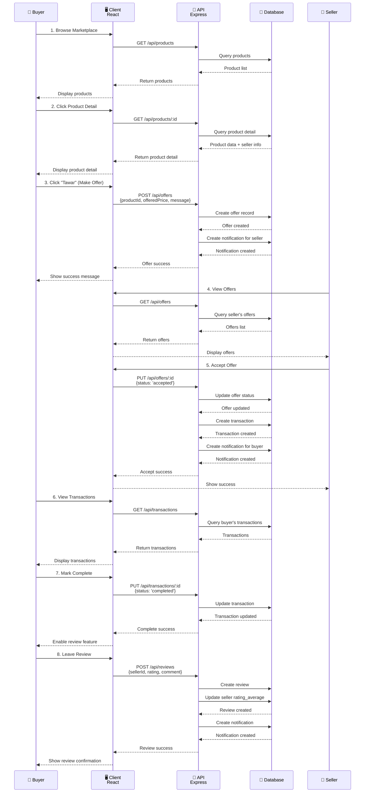
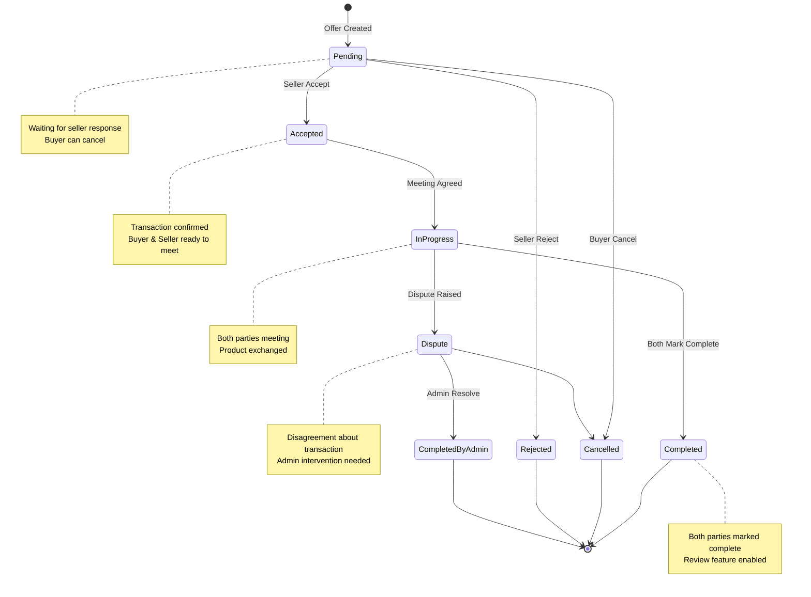
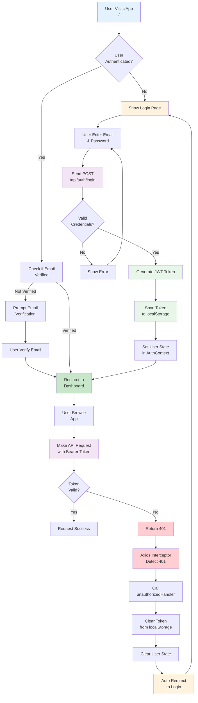
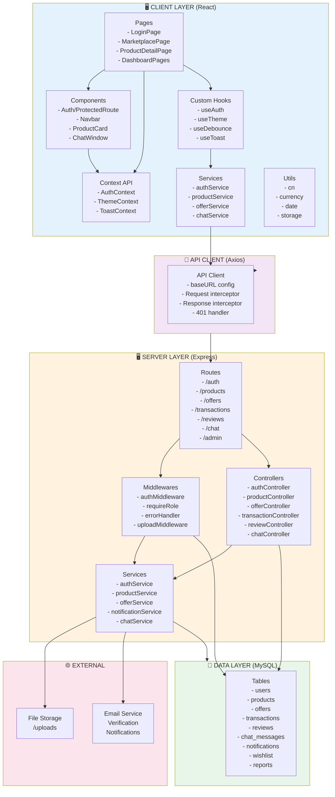

# BabePus - Diagram Documentation

Dokumen ini berisi semua diagram untuk aplikasi Babepus marketplace. Gunakan tools Mermaid online untuk memvisualisasikan.

---

## 1. MAIN USE CASE DIAGRAM

**Tool:** [Mermaid Live Editor](https://mermaid.live)  
**Copy-paste kode di bawah ke Mermaid Live Editor:**

```mermaid
graph TB
    subgraph Actors["Aktor"]
        Guest["👤 Guest"]
        User["👤 User/Buyer"]
        Seller["👤 Seller"]
        Admin["👤 Admin"]
    end

    subgraph Auth["Authentication & Profile"]
        UC1["UC-001: Register"]
        UC2["UC-002: Login"]
        UC3["UC-003: Verify Email"]
        UC4["UC-004: Auto Logout"]
        UC26["UC-026: Edit Profile"]
        UC27["UC-027: Upload Avatar"]
    end

    subgraph Products["Product Management"]
        UC5["UC-005: List Product"]
        UC6["UC-006: Edit Product"]
        UC7["UC-007: Delete Product"]
        UC8["UC-008: Browse Marketplace"]
        UC9["UC-009: View Product Detail"]
    end

    subgraph Offers["Offer & Negotiation"]
        UC10["UC-010: Make Offer"]
        UC11["UC-011: View Offers"]
        UC12["UC-012: Accept/Reject Offer"]
    end

    subgraph Transactions["Transactions"]
        UC13["UC-013: View Transactions"]
        UC14["UC-014: Complete Transaction"]
        UC15["UC-015: Make Review"]
        UC16["UC-016: View Reviews"]
    end

    subgraph Wishlist["Wishlist"]
        UC17["UC-017: Add to Wishlist"]
        UC18["UC-018: View Wishlist"]
        UC19["UC-019: Remove from Wishlist"]
    end

    subgraph Chat["Chat & Messaging"]
        UC20["UC-020: Open Chat"]
        UC21["UC-021: Send Message"]
        UC22["UC-022: View Chat List"]
    end

    subgraph Notifications["Notifications"]
        UC23["UC-023: View Notifications"]
        UC24["UC-024: Mark as Read"]
    end

    subgraph Analytics["Analytics"]
        UC25["UC-025: View Analytics"]
    end

    subgraph AdminFunctions["Admin"]
        UC28["UC-028: Admin Dashboard"]
        UC29["UC-029: Suspend User"]
        UC30["UC-030: Moderate Reports"]
        UC31["UC-031: Report Content"]
        UC32["UC-032: View Pricing"]
    end

    Guest --> UC1
    Guest --> UC2
    Guest --> UC8
    
    User --> UC2
    User --> UC3
    User --> UC4
    User --> UC26
    User --> UC27
    User --> UC8
    User --> UC9
    User --> UC10
    User --> UC13
    User --> UC14
    User --> UC15
    User --> UC16
    User --> UC17
    User --> UC18
    User --> UC19
    User --> UC20
    User --> UC21
    User --> UC22
    User --> UC23
    User --> UC24
    User --> UC31
    
    Seller --> UC5
    Seller --> UC6
    Seller --> UC7
    Seller --> UC11
    Seller --> UC12
    Seller --> UC25
    
    Admin --> UC28
    Admin --> UC29
    Admin --> UC30

style Auth fill:#e1f5ff
style Products fill:#f3e5f5
style Offers fill:#fff3e0
style Transactions fill:#e8f5e9
style Wishlist fill:#fce4ec
style Chat fill:#f1f8e9
style Notifications fill:#e0f2f1
style Analytics fill:#ede7f6
style AdminFunctions fill:#ffebee
```

---

## 2. PRODUCT PURCHASE FLOW (Sequence Diagram)

**Menunjukkan:** Alur dari browse produk hingga review  
**Interaksi:** Buyer → Client → API → Database → Seller

---

## 3. TRANSACTION STATE MACHINE

**Menunjukkan:** Semua state transaksi dan transisi yang valid

---

## 4. AUTHENTICATION FLOW DIAGRAM

**Menunjukkan:** Detail proses login, token handling, dan auto-logout

---

## 5. SYSTEM ARCHITECTURE DIAGRAM

**Menunjukkan:** Layer-based architecture (Client → API → Server → Database)

---

## 6. DETAILED OFFER & NEGOTIATION FLOW

**Menunjukkan:** 13 tahapan proses tawar-menawar dengan detail API calls

```mermaid
graph LR
    Buyer["👤 Buyer"] -->|1. Browse & Select| Marketplace["Marketplace"]
    Marketplace -->|2. View Detail| ProdDetail["Product Detail<br/>Product A - Rp 500K"]
    
    ProdDetail -->|3. Click 'Tawar'| OfferForm["Offer Form"]
    OfferForm -->|4. Input Price<br/>& Message| OfferInput["Harga: Rp 400K<br/>Message: Nego?"]
    OfferInput -->|5. Submit| BuyerAPI["POST /api/offers"]
    
    BuyerAPI -->|Create Offer| DB1["DB: offers table<br/>status=pending"]
    DB1 -->|Notification| DB2["DB: notifications"]
    
    DB1 -->|6. Notify| SellerNotif["🔔 Notification"]
    SellerNotif -->|7. Click| Seller["👤 Seller"]
    
    Seller -->|8. View Offers| OfferList["Dashboard > Offers"]
    OfferList -->|9. See Pending| OfferDetail["Offer Detail<br/>Buyer: User123<br/>Price: Rp 400K<br/>Status: Pending"]
    
    OfferDetail -->|10a. Accept| AcceptAPI["PUT /api/offers<br/>status=accepted"]
    OfferDetail -->|10b. Reject| RejectAPI["PUT /api/offers<br/>status=rejected"]
    OfferDetail -->|10c. Counter| CounterAPI["PUT /api/offers<br/>counter_price=450K"]
    
    AcceptAPI -->|Update DB| DB3["DB: offers table<br/>status=accepted"]
    RejectAPI -->|Update DB| DB4["DB: offers table<br/>status=rejected"]
    CounterAPI -->|Update DB| DB5["DB: offers table<br/>status=countered<br/>counter_price=450K"]
    
    DB3 -->|Create Transaction| TransDB["DB: transactions<br/>status=accepted"]
    DB3 -->|Notify Buyer| BuyerNotif2["🔔 Offer Accepted!"]
    
    DB4 -->|Notify Buyer| BuyerNotif3["🔔 Offer Rejected"]
    
    DB5 -->|Notify Buyer| BuyerNotif4["🔔 Counter Offer<br/>Rp 450K"]
    BuyerNotif4 -->|11. Buyer Respond| OfferForm2["Accept/Reject<br/>Counter Offer"]
    OfferForm2 -->|Back to Accept/Reject| AcceptAPI
    
    BuyerNotif2 -->|12. Both Confirm| Meeting["Agree to Meet"]
    Meeting -->|13. Mark Complete| CompleteAPI["PUT /api/transactions<br/>status=completed"]
    CompleteAPI -->|Update DB| TransDB2["DB: transactions<br/>status=completed"]
    TransDB2 -->|Enable Review| ReviewFeature["Review Feature<br/>Available"]
    
    style Buyer fill:#bbdefb
    style Seller fill:#bbdefb
    style Marketplace fill:#c8e6c9
    style ProdDetail fill:#c8e6c9
    style OfferForm fill:#fff9c4
    style OfferList fill:#fff9c4
    style BuyerAPI fill:#ffe0b2
    style AcceptAPI fill:#ffe0b2
    style RejectAPI fill:#ffe0b2
    style CounterAPI fill:#ffe0b2
    style DB1 fill:#e1f5fe
    style DB2 fill:#e1f5fe
    style TransDB fill:#e1f5fe
    style TransDB2 fill:#e1f5fe
    style BuyerNotif2 fill:#f8bbd0
    style BuyerNotif3 fill:#f8bbd0
    style BuyerNotif4 fill:#f8bbd0
    style SellerNotif fill:#f8bbd0
    style ReviewFeature fill:#c8e6c9
```

---

## 📋 Cara Menggunakan Diagram Ini

### Option 1: Mermaid Live Editor (Online)
1. Buka [https://mermaid.live](https://mermaid.live)
2. Copy-paste kode mermaid dari section di atas
3. Klik "Render" untuk visualisasi
4. Download sebagai SVG atau PNG

### Option 2: VS Code Plugin
1. Install extension: "Markdown Preview Mermaid Support"
2. Buka file markdown ini
3. Tekan Ctrl+Shift+V untuk preview
4. Diagram akan otomatis di-render

### Option 3: GitHub
1. Push file ini ke GitHub repository
2. Diagram akan otomatis di-render di GitHub preview

### Option 4: Notion/Confluence
1. Copy diagram dari Mermaid Live sebagai image
2. Paste ke Notion/Confluence docs

---

## 📝 Ringkasan Diagram

| No | Diagram | Gunanya |
|----|---------|---------|
| 1 | Main Use Case | Overview semua 32 use case & relasi dengan aktor |
| 2 | Purchase Flow | Sequence lengkap browse → tawar → transaksi → review |
| 3 | Transaction State | Semua state transaksi dan transisi yang valid |
| 4 | Auth Flow | Detail login, token, interceptor, auto-logout |
| 5 | Architecture | Layer-based system: Client → API → Server → DB |
| 6 | Offer Flow | Detail 13 tahapan proses tawar-menawar |

---
Thank you for coming
**Last Updated:** April 24, 2026  
**File:** DIAGRAMS.md (persisten di workspace)
