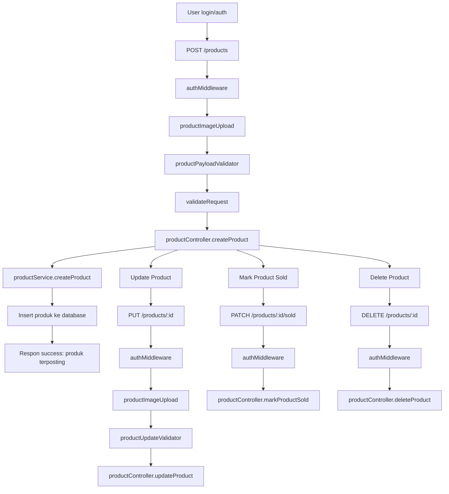

# Diagram Alur Pemesanan dan Pemostingan Barang - BabePus

Diagram berikut menggambarkan alur backend untuk:
1. Pemostingan barang baru oleh penjual
2. Proses pemesanan barang oleh pembeli melalui tawaran dan transaksi escrow

## A. Alur Pemostingan Barang



## B. Alur Pemesanan Barang

```mermaid
graph TD
  A[Buyer login/auth] --> B[POST /offers]
  B --> C[authMiddleware]
  C --> D[createOfferValidator]
  D --> E[validateRequest]
  E --> F[offerController.createOffer]
  F --> G[offerService.createOffer]
  G --> H[Validasi, cek produk, buat offer]
  H --> I[Insert offer ke database]
  I --> J[Respon: tawaran berhasil dikirim]

  J --> K[Seller lihat tawaran incoming]
  K --> L[GET /offers/incoming]
  L --> M[offerController.getIncomingOffers]
  M --> N[offerService.getIncomingOffers]

  N --> O[Seller accept offer]
  O --> P[PATCH /offers/:id/accept]
  P --> Q[idParam + validateRequest]
  Q --> R[offerController.acceptOffer]
  R --> S[offerService.acceptOffer]
  S --> T[Buat transaksi baru dari offer]
  T --> U[Insert transactions & escrow data]
  U --> V[Respon: transaksi dibuat otomatis]

  O --> W[Seller reject offer]
  W --> X[PATCH /offers/:id/reject]
  X --> Y[idParam + validateRequest]
  Y --> Z[offerController.rejectOffer]
  Z --> AA[offerService.rejectOffer]

  U --> AB[Buyer/Seller konfirmasi escrow]
  AB --> AC[PATCH /transactions/:id/escrow/buyer-confirm]
  AB --> AD[PATCH /transactions/:id/escrow/seller-confirm]
  AC --> AE[completeTransactionValidator]
  AD --> AE
  AE --> AF[transactionController.confirmBuyer / confirmSeller]
  AF --> AG[transactionService.confirmEscrow]
  AG --> AH[Update buyer/seller confirm timestamps]
  AH --> AI[Jika kedua pihak confirm -> update status completed, release escrow]

  U --> AJ[Buyer selesaikan transaksi manual]
  AJ --> AK[PATCH /transactions/:id/complete]
  AK --> AL[completeTransactionValidator]
  AL --> AM[transactionController.completeTransaction]
  AM --> AN[transactionService.completeTransaction]
  AN --> AO[Update status completed, release escrow]

  AG --> AP[Create notification ke pihak lain]
  AP --> AQ[User menerima notifikasi status escrow]
```}
