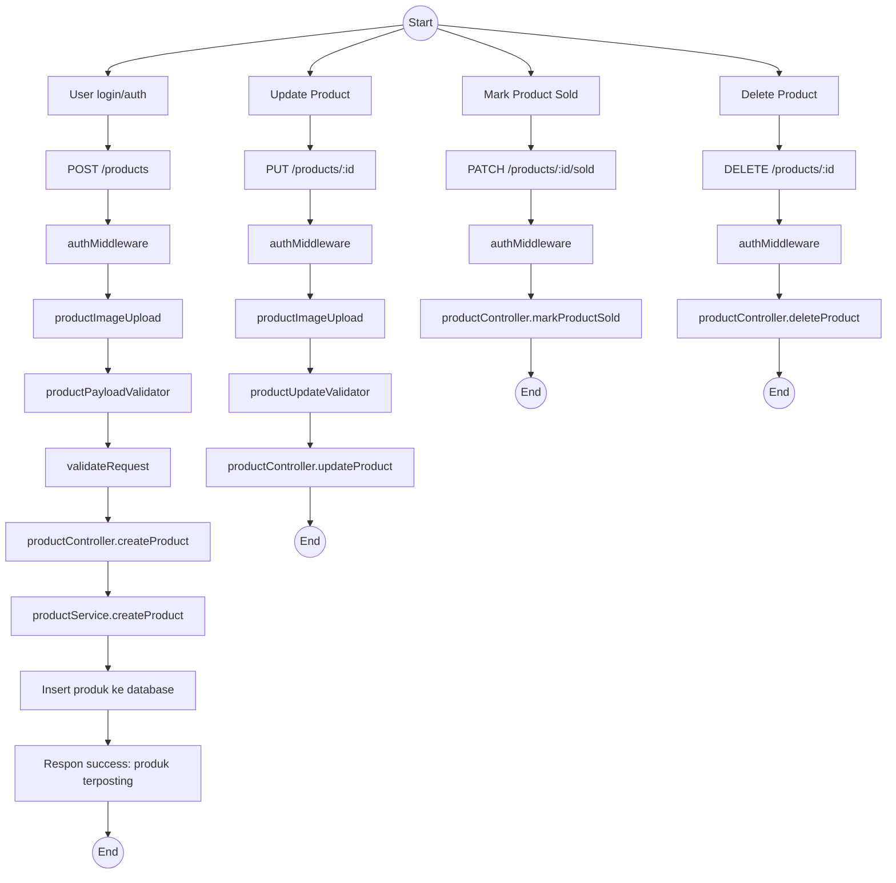
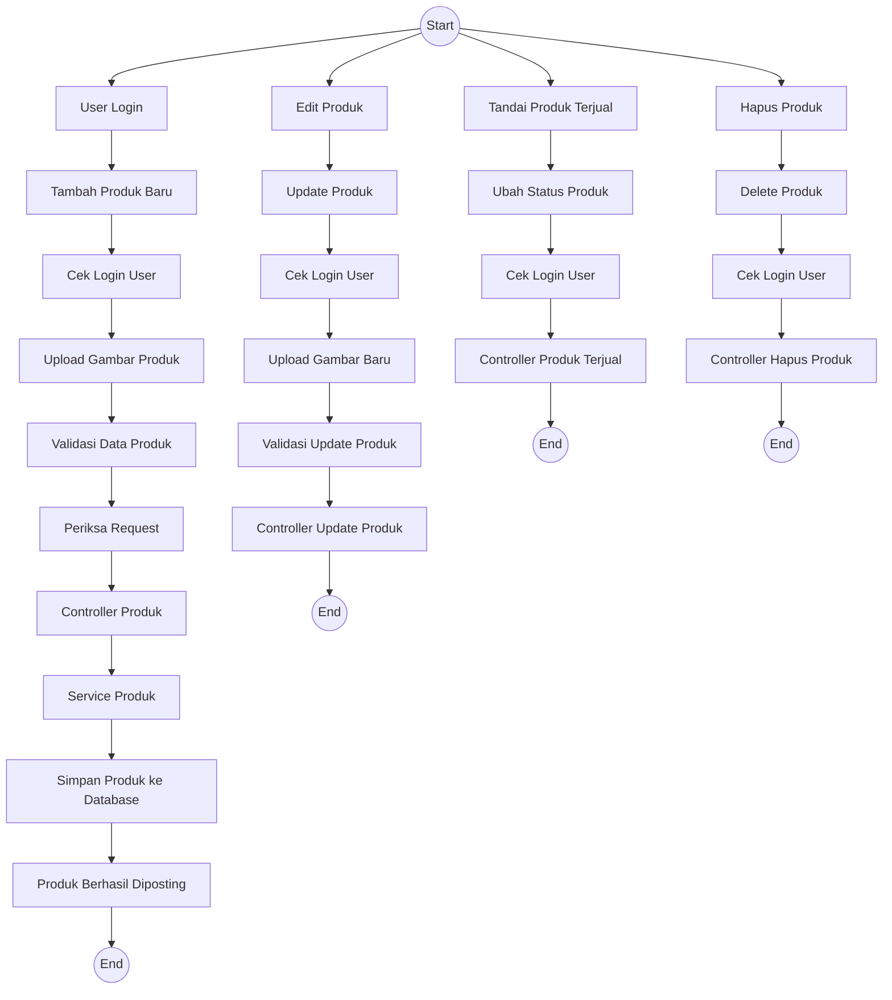
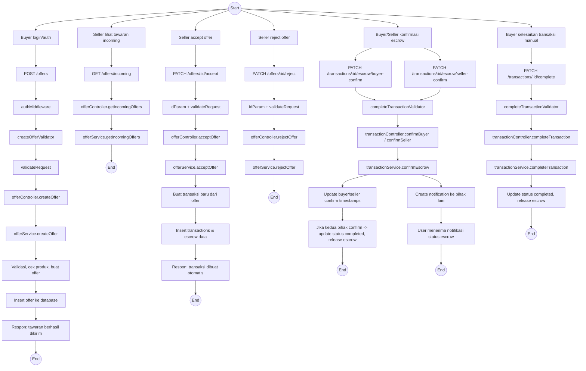
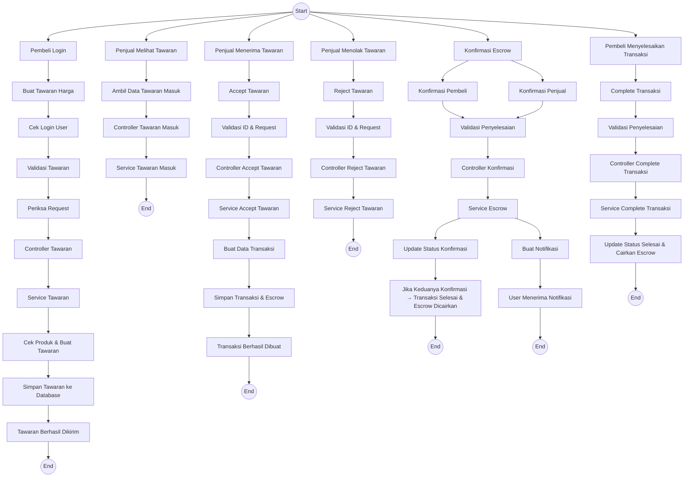

# Diagram Alur Pemesanan dan Pemostingan Barang - BabePus

Diagram berikut menggambarkan alur backend untuk:
1. Pemostingan barang baru oleh penjual
2. Proses pemesanan barang oleh pembeli melalui tawaran dan transaksi escrow

## A. Alur Pemostingan Barang

## easy to read

## B. Alur Pemesanan Barang

## easy to Read

