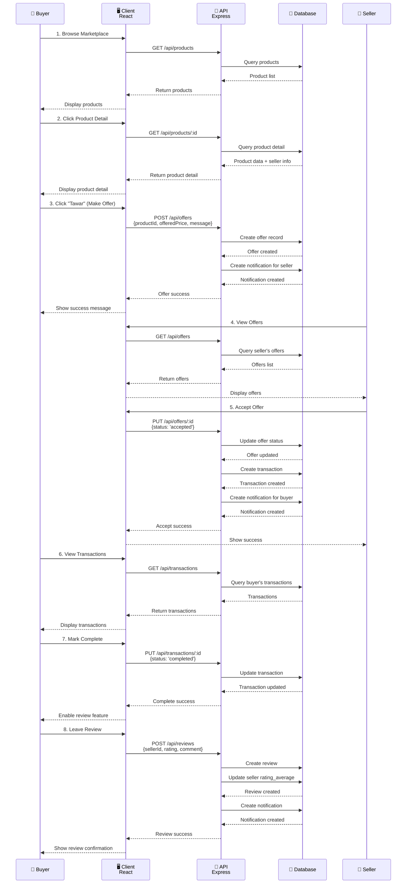
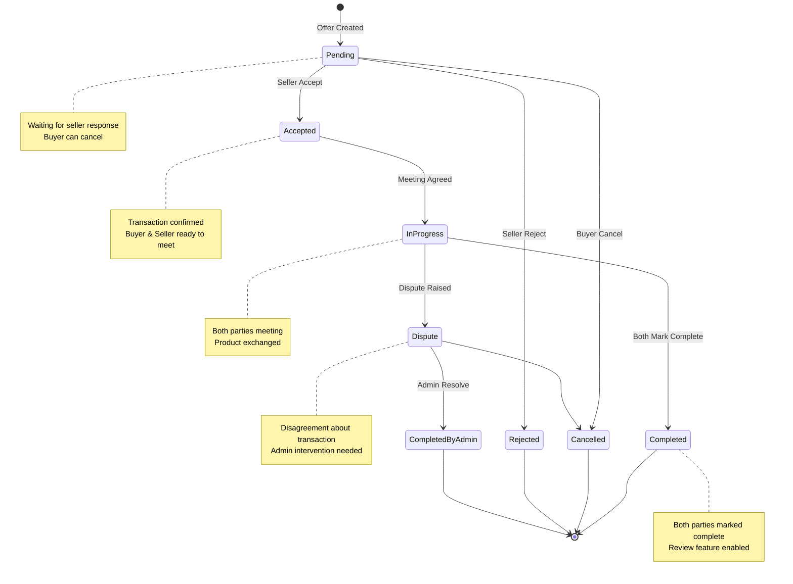
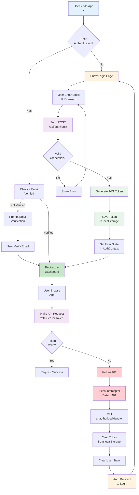
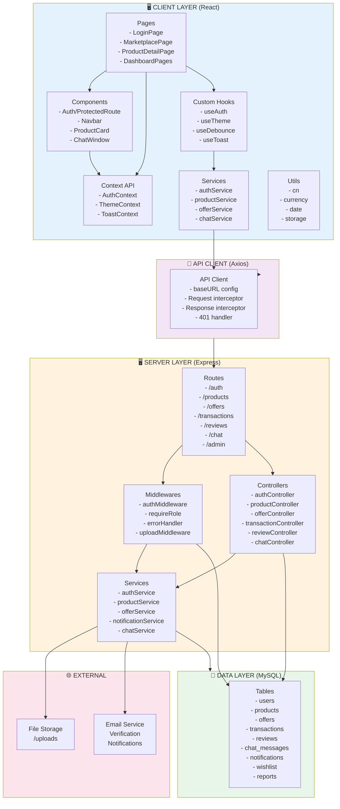

# Use Cases - BabePus Marketplace

## Ringkasan
BabePus adalah aplikasi marketplace untuk jual-beli barang bekas khusus untuk komunitas kampus. Pengguna dapat menjual produk, membeli, menawar, dan berinteraksi dengan buyer/seller lain.

---

## 1. USER REGISTRATION & AUTHENTICATION

### UC-001: Register Pengguna Baru
**Actor:** Guest (Calon pengguna)  
**Precondition:** User belum memiliki akun  
**Main Flow:**
1. User membuka halaman Register
2. User mengisi form dengan:
   - Email kampus
   - Password
   - Nama lengkap
   - Nomor telepon
   - Kampus
   - Fakultas
   - Program studi
   - Nomor induk mahasiswa (student ID)
3. Sistem validasi input
4. Sistem hash password menggunakan bcrypt
5. Sistem menyimpan user ke database
6. Sistem mengirim verification token ke email
7. User diarahkan ke halaman login

**Postcondition:** User berhasil terdaftar dan email verifikasi dikirim

---

### UC-002: Login Pengguna
**Actor:** Registered User  
**Precondition:** User sudah terdaftar  
**Main Flow:**
1. User membuka halaman Login
2. User mengisi email dan password
3. Sistem validasi kredensial terhadap database
4. Sistem generate JWT token
5. Token disimpan di localStorage
6. User diarahkan ke dashboard/marketplace
7. Header Authorization otomatis mengirim Bearer token

**Postcondition:** User berhasil login dan authenticated

---

### UC-003: Verifikasi Email
**Actor:** Registered User  
**Precondition:** User sudah register, email belum diverifikasi  
**Main Flow:**
1. User menerima email dengan link verifikasi
2. User klik link atau masukkan token manual
3. Sistem validasi token verifikasi email
4. Sistem update status `email_verified_at` di database
5. Sistem tampilkan notifikasi sukses

**Postcondition:** Email user terverifikasi, akun fully activated

---

### UC-004: Auto Logout (Token Expired)
**Actor:** Authenticated User  
**Precondition:** User sedang login  
**Main Flow:**
1. User melakukan request ke API
2. Server mengembalikan response 401 (Unauthorized)
3. Interceptor axios mendeteksi 401
4. Sistem trigger `unauthorizedHandler()`
5. Sistem hapus token dari localStorage
6. Sistem clear user state di AuthContext
7. User diarahkan otomatis ke halaman login

**Postcondition:** Session user berakhir, harus login ulang

---

## 2. PRODUCT MANAGEMENT (SELLER)

### UC-005: List Produk Baru
**Actor:** Authenticated User (Seller)  
**Precondition:** User sudah login  
**Main Flow:**
1. Seller membuka halaman "Tambah Produk" di Dashboard
2. Seller mengisi form:
   - Nama produk
   - Deskripsi
   - Kategori
   - Harga
   - Kondisi (baru/bekas)
   - Foto produk (multiple upload)
   - Lokasi/kampus
3. Sistem validasi input menggunakan express-validator
4. Sistem upload foto ke folder `/uploads`
5. Sistem simpan data produk ke table `products`
6. Sistem set status produk = "active"
7. Sistem tampilkan notifikasi sukses

**Postcondition:** Produk berhasil di-list di marketplace

---

### UC-006: Edit Produk
**Actor:** Authenticated User (Seller)  
**Precondition:** User sudah login, user adalah pemilik produk  
**Main Flow:**
1. Seller membuka halaman Dashboard > Products
2. Seller pilih produk untuk edit
3. Seller ubah detail produk (nama, harga, foto, dll)
4. Sistem validasi input
5. Sistem update record produk di database
6. Sistem update foto jika ada file baru
7. Sistem tampilkan notifikasi sukses

**Postcondition:** Produk berhasil diperbarui

---

### UC-007: Hapus Produk
**Actor:** Authenticated User (Seller)  
**Precondition:** User sudah login, user adalah pemilik produk  
**Main Flow:**
1. Seller membuka halaman Dashboard > Products
2. Seller pilih produk untuk dihapus
3. Sistem tampilkan konfirmasi dialog
4. Seller konfirmasi delete
5. Sistem soft-delete atau hard-delete record produk
6. Sistem hapus foto terkait
7. Sistem tampilkan notifikasi sukses

**Postcondition:** Produk dihapus dari marketplace

---

### UC-008: View Produk di Marketplace
**Actor:** Any User (authenticated or guest)  
**Precondition:** Ada produk aktif di database  
**Main Flow:**
1. User masuk ke halaman Marketplace
2. Sistem load daftar produk dari API
3. Sistem tampilkan produk dengan:
   - Foto
   - Nama
   - Harga
   - Kondisi
   - Lokasi/kampus
   - Rating seller
4. User dapat filter berdasarkan:
   - Kategori
   - Harga range (slider)
   - Kondisi
   - Lokasi
5. User dapat search by keyword
6. Sistem load produk sesuai filter

**Postcondition:** User melihat list produk sesuai filter

---

### UC-009: View Detail Produk
**Actor:** Any User  
**Precondition:** User sudah di halaman Marketplace  
**Main Flow:**
1. User klik produk di list
2. Sistem load detail produk dari API
3. Sistem tampilkan:
   - Foto carousel
   - Nama produk
   - Deskripsi lengkap
   - Harga
   - Kondisi
   - Lokasi
   - Seller info (nama, rating, avatar)
   - Tombol "Tawar" / "Chat Seller"
4. Jika user authenticated:
   - Tampilkan tombol "Tambah ke Wishlist"
   - Tampilkan chat history (jika ada)

**Postcondition:** User melihat detail produk secara lengkap

---

## 3. OFFER & NEGOTIATION

### UC-010: Buat Penawaran (Offer)
**Actor:** Authenticated User (Buyer)  
**Precondition:** User sudah login, melihat detail produk  
**Main Flow:**
1. Buyer klik tombol "Tawar" di halaman product detail
2. Sistem tampilkan form offer dengan:
   - Harga yang ditawarkan (pre-fill dengan harga produk)
   - Pesan penawaran (optional)
3. Buyer edit harga dan tulis pesan
4. Buyer submit form
5. Sistem validasi harga (harus lebih kecil dari harga jual)
6. Sistem simpan offer ke table `offers`
7. Sistem set status offer = "pending"
8. Sistem buat notification untuk seller

**Postcondition:** Offer berhasil dibuat, seller mendapat notifikasi

---

### UC-011: View Offers (Seller)
**Actor:** Authenticated User (Seller)  
**Precondition:** Seller sudah login, ada offer untuk produk seller  
**Main Flow:**
1. Seller buka Dashboard > Offers
2. Sistem load daftar offer untuk produk seller
3. Sistem tampilkan offer dengan:
   - Produk
   - Buyer info
   - Harga penawaran
   - Status (pending/rejected/accepted)
   - Waktu penawaran
4. Seller dapat filter by status

**Postcondition:** Seller melihat semua offer yang masuk

---

### UC-012: Terima/Tolak Penawaran
**Actor:** Authenticated User (Seller)  
**Precondition:** Seller melihat list offer  
**Main Flow:**
1. Seller klik offer yang ingin di-respond
2. Seller pilih "Terima" atau "Tolak"
3. Jika tolak:
   - Sistem tampilkan optional form untuk counter-offer harga
   - Seller bisa tulis alasan tolak
4. Sistem update status offer di database
5. Sistem buat notification untuk buyer
6. Sistem auto-create transaction jika offer diterima

**Postcondition:** Offer diterima/ditolak, transaction dibuat atau buyer diberitahu

---

## 4. TRANSACTION & PAYMENT

### UC-013: View Transactions
**Actor:** Authenticated User (Buyer atau Seller)  
**Precondition:** User sudah login, ada transaksi buyer/seller  
**Main Flow:**
1. User buka Dashboard > Transactions
2. Sistem load daftar transaksi user
3. Sistem tampilkan status transaksi:
   - Pending
   - Completed
   - Cancelled
4. User dapat filter by status
5. Sistem tampilkan detail:
   - Produk
   - Counterpart user info
   - Harga
   - Waktu transaksi
   - Lokasi meetup (jika ada)

**Postcondition:** User melihat semua transaksi mereka

---

### UC-014: Complete Transaction
**Actor:** Authenticated User (Buyer atau Seller)  
**Precondition:** Transaction dalam status "accepted" atau "pending"  
**Main Flow:**
1. Buyer dan Seller agree untuk meetup
2. Salah satu (atau keduanya) bisa mark transaksi as "completed"
3. Sistem update transaction status = "completed"
4. Sistem trigger notifikasi untuk sisi lain
5. Sistem activate review feature

**Postcondition:** Transaction marked as completed, review dapat dilakukan

---

## 5. REVIEW & RATING

### UC-015: Buat Review
**Actor:** Authenticated User (Buyer atau Seller)  
**Precondition:** User sudah complete transaction  
**Main Flow:**
1. User buka halaman transaction detail
2. User klik tombol "Buat Review"
3. Sistem tampilkan form review dengan:
   - Rating (1-5 stars)
   - Judul review
   - Deskripsi/komentar
   - Foto (optional)
4. User submit review
5. Sistem validasi input
6. Sistem simpan review ke table `reviews`
7. Sistem update average rating user:
   - `rating_average = SUM(rating) / COUNT(reviews)`
   - `rating_count = COUNT(reviews)`
8. Sistem buat notification untuk counterpart

**Postcondition:** Review berhasil dibuat, rating user terupdate

---

### UC-016: View Reviews
**Actor:** Any User  
**Precondition:** Ada review untuk user tertentu  
**Main Flow:**
1. User buka profile seller/buyer
2. Sistem load reviews dari table `reviews`
3. Sistem tampilkan:
   - Review list sorted by date
   - Rating
   - Judul
   - Deskripsi
   - Avatar reviewer
   - Rating average dan count di header

**Postcondition:** User melihat semua review untuk user tersebut

---

## 6. WISHLIST

### UC-017: Tambah ke Wishlist
**Actor:** Authenticated User (Buyer)  
**Precondition:** User sudah login, melihat product detail  
**Main Flow:**
1. User klik tombol "Tambah ke Wishlist" atau heart icon
2. Sistem simpan relasi user-product ke table `wishlist`
3. Sistem ubah icon heart menjadi filled
4. Sistem tampilkan notifikasi "Ditambahkan ke Wishlist"

**Postcondition:** Produk ditambahkan ke wishlist user

---

### UC-018: View Wishlist
**Actor:** Authenticated User (Buyer)  
**Precondition:** User sudah login  
**Main Flow:**
1. User buka Dashboard > Wishlist
2. Sistem load produk dari wishlist user
3. Sistem tampilkan grid/list produk wishlist
4. User dapat:
   - Klik produk untuk detail
   - Hapus dari wishlist
   - Sort/filter wishlist

**Postcondition:** User melihat semua wishlist mereka

---

### UC-019: Hapus dari Wishlist
**Actor:** Authenticated User  
**Precondition:** Ada produk di wishlist  
**Main Flow:**
1. User klik tombol hapus di wishlist item
2. Sistem tampilkan konfirmasi
3. User konfirmasi
4. Sistem delete relasi dari table `wishlist`
5. Sistem tampilkan notifikasi sukses

**Postcondition:** Produk dihapus dari wishlist

---

## 7. CHAT & MESSAGING

### UC-020: Buka Chat dengan User Lain
**Actor:** Authenticated User  
**Precondition:** User sudah login, melihat product atau user profile  
**Main Flow:**
1. User klik tombol "Chat" atau icon chat
2. Sistem check apakah conversation sudah exist
3. Jika tidak exist:
   - Sistem create conversation di table `chat` atau `conversations`
4. Sistem load chat history
5. Sistem tampilkan chat window dengan:
   - Nama user
   - Avatar
   - Message history
   - Input message box

**Postcondition:** Chat window dibuka

---

### UC-021: Kirim Pesan Chat
**Actor:** Authenticated User  
**Precondition:** Chat window sudah terbuka  
**Main Flow:**
1. User ketik pesan di input box
2. User klik tombol send atau press Enter
3. Sistem validasi pesan (tidak kosong)
4. Sistem simpan message ke database dengan:
   - Sender ID
   - Receiver ID
   - Message content
   - Timestamp
5. Sistem emit real-time update ke receiver (jika online)
6. Sistem tampilkan message di UI
7. Receiver dapat lihat message in real-time atau saat membuka chat

**Postcondition:** Message berhasil terkirim

---

### UC-022: View Chat List
**Actor:** Authenticated User  
**Precondition:** User sudah login  
**Main Flow:**
1. User buka Dashboard > Chat
2. Sistem load list conversation user
3. Sistem tampilkan:
   - Avatar user
   - Nama user
   - Last message preview
   - Timestamp
   - Unread badge (jika ada)
4. User dapat sort by recent atau search

**Postcondition:** User melihat list semua chat conversations

---

## 8. NOTIFICATIONS

### UC-023: View Notifications
**Actor:** Authenticated User  
**Precondition:** User sudah login, ada notification  
**Main Flow:**
1. User klik notification bell icon di navbar
2. Sistem load notification list:
   - Dari table `notifications`
   - Filter by user ID
   - Sorted by timestamp DESC
3. Sistem tampilkan notifikasi dengan:
   - Icon (based on type)
   - Message
   - Timestamp
   - Link/action
4. Notification dapat di-mark sebagai read
5. User dapat klik notification untuk navigate

**Postcondition:** User melihat notification list

---

### UC-024: Mark Notification as Read
**Actor:** Authenticated User  
**Precondition:** Ada unread notification  
**Main Flow:**
1. User buka notification panel
2. User klik notification atau tombol read
3. Sistem update `is_read = true` di database
4. Sistem remove badge dari notification

**Postcondition:** Notification marked as read

---

## 9. SELLER ANALYTICS

### UC-025: View Seller Analytics
**Actor:** Authenticated User (Seller)  
**Precondition:** User sudah login sebagai seller, ada transaction history  
**Main Flow:**
1. Seller buka Dashboard > Analytics
2. Sistem load analytics data:
   - Total products
   - Total completed transactions
   - Total revenue
   - Average rating
   - Product performance (popular products)
   - Time series chart (sales per period)
3. Sistem tampilkan dalam dashboard format
4. Seller dapat filter by date range

**Postcondition:** Seller melihat analytics lengkap

---

## 10. PROFILE MANAGEMENT

### UC-026: View/Edit Profile
**Actor:** Authenticated User  
**Precondition:** User sudah login  
**Main Flow:**
1. User buka Dashboard > Profile
2. Sistem load user data dari database
3. User dapat melihat/edit:
   - Nama lengkap
   - Email
   - Nomor telepon
   - Kampus
   - Fakultas
   - Program studi
   - Student ID
   - Bio
   - Avatar/Foto profil
4. User submit form
5. Sistem validasi input
6. Sistem update user record di database
7. Sistem tampilkan notifikasi sukses

**Postcondition:** Profile user berhasil diupdate

---

### UC-027: Upload Avatar
**Actor:** Authenticated User  
**Precondition:** User di halaman profile edit  
**Main Flow:**
1. User klik area upload avatar
2. User select file gambar dari device
3. Sistem validasi file (format, size)
4. Sistem upload ke folder `/uploads`
5. Sistem update `avatar_url` di database
6. Sistem tampilkan preview avatar baru
7. Sistem tampilkan notifikasi sukses

**Postcondition:** Avatar berhasil diupload

---

## 11. ADMIN FUNCTIONS

### UC-028: View Admin Dashboard
**Actor:** Authenticated Admin User  
**Precondition:** User sudah login dengan role = "admin"  
**Main Flow:**
1. Admin buka halaman `/admin`
2. Middleware `requireRole("admin")` verify role user
3. Sistem load admin dashboard dengan:
   - Total users
   - Total products
   - Total transactions
   - Total revenue
   - Reported items
   - Suspended users
   - Unverified sellers
4. Admin dapat navigate ke sub-sections

**Postcondition:** Admin melihat dashboard overview

---

### UC-029: Suspend/Ban User
**Actor:** Admin User  
**Precondition:** Admin sudah login  
**Main Flow:**
1. Admin masuk ke user management section
2. Admin cari atau filter user untuk di-suspend
3. Admin klik user
4. Admin klik tombol "Suspend"
5. Admin input alasan suspension (optional)
6. Sistem update `is_suspended = true` di database
7. Sistem trigger logout otomatis untuk user tersebut
8. Sistem kirim notifikasi ke user
9. User tidak bisa login sampai admin lifts suspension

**Postcondition:** User suspended, tidak bisa access aplikasi

---

### UC-030: Review & Moderate Reported Content
**Actor:** Admin User  
**Precondition:** Ada reported products atau users  
**Main Flow:**
1. Admin buka Reports section
2. Sistem load daftar report dari table `reports`
3. Sistem tampilkan:
   - Reported item (product/user)
   - Reason
   - Reporter info
   - Status (open/resolved)
4. Admin klik report untuk detail
5. Admin dapat:
   - Reject report
   - Approve report (dan take action)
   - Suspend related user
   - Delete reported product
6. Sistem update report status = "resolved"
7. Sistem create admin log/audit trail

**Postcondition:** Report di-resolve dan action diambil

---

## 12. REPORTING SYSTEM

### UC-031: Report Produk/User
**Actor:** Authenticated User  
**Precondition:** User sudah login  
**Main Flow:**
1. User di halaman product detail atau user profile
2. User klik menu "Report" atau "Laporkan"
3. Sistem tampilkan form report dengan:
   - Kategori (fraud, inappropriate, damage, dll)
   - Deskripsi detail
   - Attachment (optional)
4. User submit form
5. Sistem validasi input
6. Sistem simpan report ke table `reports`
7. Sistem set status = "open"
8. Sistem notify admin tentang report baru

**Postcondition:** Report berhasil dibuat, admin diberitahu

---

## 13. PRICING & COMMISSION

### UC-032: View Pricing Information
**Actor:** Any User  
**Precondition:** User di halaman marketplace atau profile  
**Main Flow:**
1. User cari informasi harga/komisi
2. User buka halaman Pricing (jika ada)
3. Sistem load pricing info dari API `/api/pricing`
4. Sistem tampilkan:
   - Commission rate
   - Fee structure
   - Payment terms
   - Example calculation

**Postcondition:** User melihat pricing information

---

## Summary Table

| UC ID | Aktor | Deskripsi | Status |
|-------|-------|-----------|--------|
| UC-001 | Guest | Register | Core |
| UC-002 | Guest | Login | Core |
| UC-003 | User | Verifikasi Email | Core |
| UC-004 | User | Auto Logout | Core |
| UC-005 | Seller | List Produk | Core |
| UC-006 | Seller | Edit Produk | Core |
| UC-007 | Seller | Hapus Produk | Core |
| UC-008 | Any | View Marketplace | Core |
| UC-009 | Any | View Product Detail | Core |
| UC-010 | Buyer | Buat Offer | Core |
| UC-011 | Seller | View Offers | Core |
| UC-012 | Seller | Accept/Reject Offer | Core |
| UC-013 | User | View Transactions | Core |
| UC-014 | User | Complete Transaction | Core |
| UC-015 | User | Buat Review | Core |
| UC-016 | Any | View Reviews | Core |
| UC-017 | Buyer | Tambah Wishlist | Feature |
| UC-018 | Buyer | View Wishlist | Feature |
| UC-019 | Buyer | Hapus Wishlist | Feature |
| UC-020 | User | Buka Chat | Feature |
| UC-021 | User | Kirim Pesan | Feature |
| UC-022 | User | View Chat List | Feature |
| UC-023 | User | View Notifications | Feature |
| UC-024 | User | Mark Notification Read | Feature |
| UC-025 | Seller | View Analytics | Feature |
| UC-026 | User | View/Edit Profile | Core |
| UC-027 | User | Upload Avatar | Feature |
| UC-028 | Admin | Admin Dashboard | Core |
| UC-029 | Admin | Suspend User | Core |
| UC-030 | Admin | Moderate Reports | Core |
| UC-031 | User | Report Content | Feature |
| UC-032 | Any | View Pricing | Info |

# BabePus - Diagram Documentation

Dokumen ini berisi semua diagram untuk aplikasi Babepus marketplace. Gunakan tools Mermaid online untuk memvisualisasikan.

---

## 1. MAIN USE CASE DIAGRAM

**Tool:** [Mermaid Live Editor](https://mermaid.live)  
**Copy-paste kode di bawah ke Mermaid Live Editor:**

```mermaid
graph TB
    subgraph Actors["Aktor"]
        Guest["👤 Guest"]
        User["👤 User/Buyer"]
        Seller["👤 Seller"]
        Admin["👤 Admin"]
    end

    subgraph Auth["Authentication & Profile"]
        UC1["UC-001: Register"]
        UC2["UC-002: Login"]
        UC3["UC-003: Verify Email"]
        UC4["UC-004: Auto Logout"]
        UC26["UC-026: Edit Profile"]
        UC27["UC-027: Upload Avatar"]
    end

    subgraph Products["Product Management"]
        UC5["UC-005: List Product"]
        UC6["UC-006: Edit Product"]
        UC7["UC-007: Delete Product"]
        UC8["UC-008: Browse Marketplace"]
        UC9["UC-009: View Product Detail"]
    end

    subgraph Offers["Offer & Negotiation"]
        UC10["UC-010: Make Offer"]
        UC11["UC-011: View Offers"]
        UC12["UC-012: Accept/Reject Offer"]
    end

    subgraph Transactions["Transactions"]
        UC13["UC-013: View Transactions"]
        UC14["UC-014: Complete Transaction"]
        UC15["UC-015: Make Review"]
        UC16["UC-016: View Reviews"]
    end

    subgraph Wishlist["Wishlist"]
        UC17["UC-017: Add to Wishlist"]
        UC18["UC-018: View Wishlist"]
        UC19["UC-019: Remove from Wishlist"]
    end

    subgraph Chat["Chat & Messaging"]
        UC20["UC-020: Open Chat"]
        UC21["UC-021: Send Message"]
        UC22["UC-022: View Chat List"]
    end

    subgraph Notifications["Notifications"]
        UC23["UC-023: View Notifications"]
        UC24["UC-024: Mark as Read"]
    end

    subgraph Analytics["Analytics"]
        UC25["UC-025: View Analytics"]
    end

    subgraph AdminFunctions["Admin"]
        UC28["UC-028: Admin Dashboard"]
        UC29["UC-029: Suspend User"]
        UC30["UC-030: Moderate Reports"]
        UC31["UC-031: Report Content"]
        UC32["UC-032: View Pricing"]
    end

    Guest --> UC1
    Guest --> UC2
    Guest --> UC8
    
    User --> UC2
    User --> UC3
    User --> UC4
    User --> UC26
    User --> UC27
    User --> UC8
    User --> UC9
    User --> UC10
    User --> UC13
    User --> UC14
    User --> UC15
    User --> UC16
    User --> UC17
    User --> UC18
    User --> UC19
    User --> UC20
    User --> UC21
    User --> UC22
    User --> UC23
    User --> UC24
    User --> UC31
    
    Seller --> UC5
    Seller --> UC6
    Seller --> UC7
    Seller --> UC11
    Seller --> UC12
    Seller --> UC25
    
    Admin --> UC28
    Admin --> UC29
    Admin --> UC30

style Auth fill:#e1f5ff
style Products fill:#f3e5f5
style Offers fill:#fff3e0
style Transactions fill:#e8f5e9
style Wishlist fill:#fce4ec
style Chat fill:#f1f8e9
style Notifications fill:#e0f2f1
style Analytics fill:#ede7f6
style AdminFunctions fill:#ffebee
```

---

## 2. PRODUCT PURCHASE FLOW (Sequence Diagram)

**Menunjukkan:** Alur dari browse produk hingga review  
**Interaksi:** Buyer → Client → API → Database → Seller

---

## 3. TRANSACTION STATE MACHINE

**Menunjukkan:** Semua state transaksi dan transisi yang valid

---

## 4. AUTHENTICATION FLOW DIAGRAM

**Menunjukkan:** Detail proses login, token handling, dan auto-logout

---

## 5. SYSTEM ARCHITECTURE DIAGRAM

**Menunjukkan:** Layer-based architecture (Client → API → Server → Database)

---

## 6. DETAILED OFFER & NEGOTIATION FLOW

**Menunjukkan:** 13 tahapan proses tawar-menawar dengan detail API calls

```mermaid
graph LR
    Buyer["👤 Buyer"] -->|1. Browse & Select| Marketplace["Marketplace"]
    Marketplace -->|2. View Detail| ProdDetail["Product Detail<br/>Product A - Rp 500K"]
    
    ProdDetail -->|3. Click 'Tawar'| OfferForm["Offer Form"]
    OfferForm -->|4. Input Price<br/>& Message| OfferInput["Harga: Rp 400K<br/>Message: Nego?"]
    OfferInput -->|5. Submit| BuyerAPI["POST /api/offers"]
    
    BuyerAPI -->|Create Offer| DB1["DB: offers table<br/>status=pending"]
    DB1 -->|Notification| DB2["DB: notifications"]
    
    DB1 -->|6. Notify| SellerNotif["🔔 Notification"]
    SellerNotif -->|7. Click| Seller["👤 Seller"]
    
    Seller -->|8. View Offers| OfferList["Dashboard > Offers"]
    OfferList -->|9. See Pending| OfferDetail["Offer Detail<br/>Buyer: User123<br/>Price: Rp 400K<br/>Status: Pending"]
    
    OfferDetail -->|10a. Accept| AcceptAPI["PUT /api/offers<br/>status=accepted"]
    OfferDetail -->|10b. Reject| RejectAPI["PUT /api/offers<br/>status=rejected"]
    OfferDetail -->|10c. Counter| CounterAPI["PUT /api/offers<br/>counter_price=450K"]
    
    AcceptAPI -->|Update DB| DB3["DB: offers table<br/>status=accepted"]
    RejectAPI -->|Update DB| DB4["DB: offers table<br/>status=rejected"]
    CounterAPI -->|Update DB| DB5["DB: offers table<br/>status=countered<br/>counter_price=450K"]
    
    DB3 -->|Create Transaction| TransDB["DB: transactions<br/>status=accepted"]
    DB3 -->|Notify Buyer| BuyerNotif2["🔔 Offer Accepted!"]
    
    DB4 -->|Notify Buyer| BuyerNotif3["🔔 Offer Rejected"]
    
    DB5 -->|Notify Buyer| BuyerNotif4["🔔 Counter Offer<br/>Rp 450K"]
    BuyerNotif4 -->|11. Buyer Respond| OfferForm2["Accept/Reject<br/>Counter Offer"]
    OfferForm2 -->|Back to Accept/Reject| AcceptAPI
    
    BuyerNotif2 -->|12. Both Confirm| Meeting["Agree to Meet"]
    Meeting -->|13. Mark Complete| CompleteAPI["PUT /api/transactions<br/>status=completed"]
    CompleteAPI -->|Update DB| TransDB2["DB: transactions<br/>status=completed"]
    TransDB2 -->|Enable Review| ReviewFeature["Review Feature<br/>Available"]
    
    style Buyer fill:#bbdefb
    style Seller fill:#bbdefb
    style Marketplace fill:#c8e6c9
    style ProdDetail fill:#c8e6c9
    style OfferForm fill:#fff9c4
    style OfferList fill:#fff9c4
    style BuyerAPI fill:#ffe0b2
    style AcceptAPI fill:#ffe0b2
    style RejectAPI fill:#ffe0b2
    style CounterAPI fill:#ffe0b2
    style DB1 fill:#e1f5fe
    style DB2 fill:#e1f5fe
    style TransDB fill:#e1f5fe
    style TransDB2 fill:#e1f5fe
    style BuyerNotif2 fill:#f8bbd0
    style BuyerNotif3 fill:#f8bbd0
    style BuyerNotif4 fill:#f8bbd0
    style SellerNotif fill:#f8bbd0
    style ReviewFeature fill:#c8e6c9
```

---

## 📋 Cara Menggunakan Diagram Ini

### Option 1: Mermaid Live Editor (Online)
1. Buka [https://mermaid.live](https://mermaid.live)
2. Copy-paste kode mermaid dari section di atas
3. Klik "Render" untuk visualisasi
4. Download sebagai SVG atau PNG

### Option 2: VS Code Plugin
1. Install extension: "Markdown Preview Mermaid Support"
2. Buka file markdown ini
3. Tekan Ctrl+Shift+V untuk preview
4. Diagram akan otomatis di-render

### Option 3: GitHub
1. Push file ini ke GitHub repository
2. Diagram akan otomatis di-render di GitHub preview

### Option 4: Notion/Confluence
1. Copy diagram dari Mermaid Live sebagai image
2. Paste ke Notion/Confluence docs

---

## 📝 Ringkasan Diagram

| No | Diagram | Gunanya |
|----|---------|---------|
| 1 | Main Use Case | Overview semua 32 use case & relasi dengan aktor |
| 2 | Purchase Flow | Sequence lengkap browse → tawar → transaksi → review |
| 3 | Transaction State | Semua state transaksi dan transisi yang valid |
| 4 | Auth Flow | Detail login, token, interceptor, auto-logout |
| 5 | Architecture | Layer-based system: Client → API → Server → DB |
| 6 | Offer Flow | Detail 13 tahapan proses tawar-menawar |

---

**Last Updated:** April 24, 2026  
**File:** DIAGRAMS.md (persisten di workspace)
